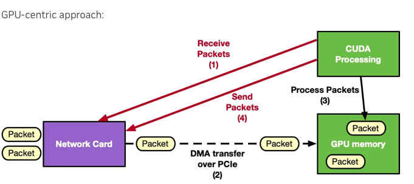
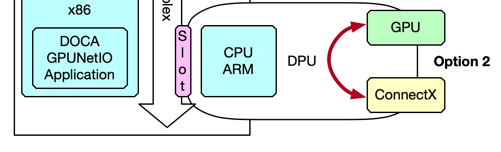
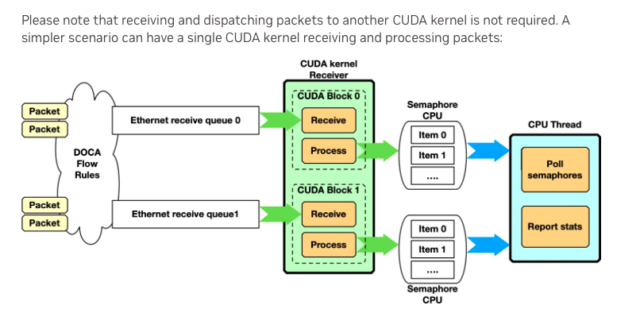

# Reunion

## Tema

Dos posibles temas:

- Packet filtering (DPI): miro el paquete buscando ASCII, si lo encuentro: OK; else: DROP.

- **Selective packet capping**: miro el paquete buscando ASCII, si no lo encuentro: conservo solo cabeceras, Si lo encuentro: ?

## Algoritmo de detección ASCII

Mantenemos el del paper por ahora. El primero es exhaustivo. El segundo es optimizado. Podemos invertarnos algo entre medias.

*Pendiente*

## Casos de interconexion

### Host -> NIC (Directo, sin DPU, sin GPU)

Se puede probar en local.

Tareas:
- Revisar interfaces de red (¿cuál es la ConnectX 6?) Candidata: enx52333fc003a1

Opciones:
- tcpdump (Filtros tipo BPF, wireshark)
- **libpcap (en C)**
- XDP (eXpress Data Path, en C)

Desventaja: capping no tiene porque ser "real", solo afecta al almacenamiento


### (Host) GPU -> NIC (Usando la GPU, sin DPU)

https://docs.nvidia.com/doca/sdk/doca+gpunetio/index.html#src-2448907751_safe-id-RE9DQUdQVU5ldElPLU9wdGlvbjI6RFBVQ29udmVyZ2VkQ2FyZA

Exponer GPU al host
```
PCI_DOWNSTREAM_PORT_OWNER[4]        DEVICE_DEFAULT(0)
```
Exponer GPU a la DPU
```
PCI_DOWNSTREAM_PORT_OWNER[4]        EMBEDDED_CPU(15)
```






https://docs.nvidia.com/doca/sdk/doca+gpunetio/index.html#src-2448907751_DOCAGPUNetIO-Architecture

Ventaja: se manda el paquete cortado.

Interesa definir bien los buffer




### DPU -> NIC (Usando la DPU, sin GPU)

Ventaja: DPU -> NIC interactúa como CPU -> NIC.
Desventaja: NI de como mover los datos CPU <-> DPU